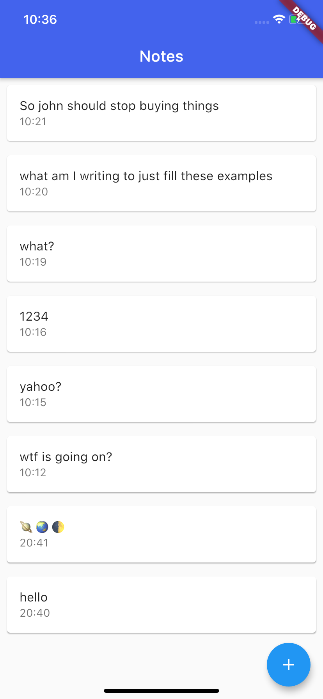
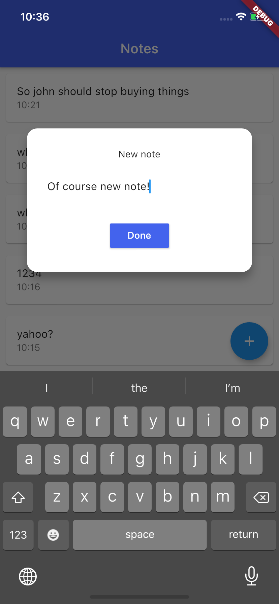
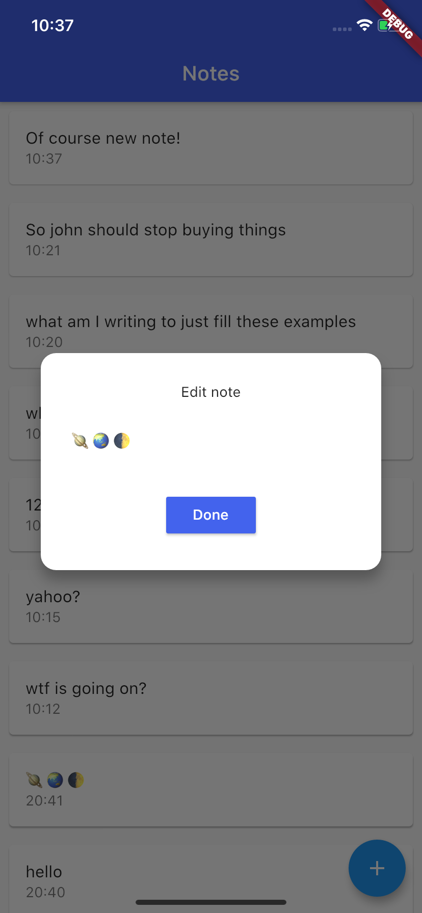

# Simple Note

Simple flutter application which helps you to quick note and quick edit notes.

### What learned:
- [x] using database and sqflite.
- [x] working with alerts.
- [x] creating custom designed dialogs.
- [x] transfer and work with data between views.
- [x] better filing and better structure for app folders and files.
- [x] and many small things.

### hours spent : 5

### screen-shots :
  